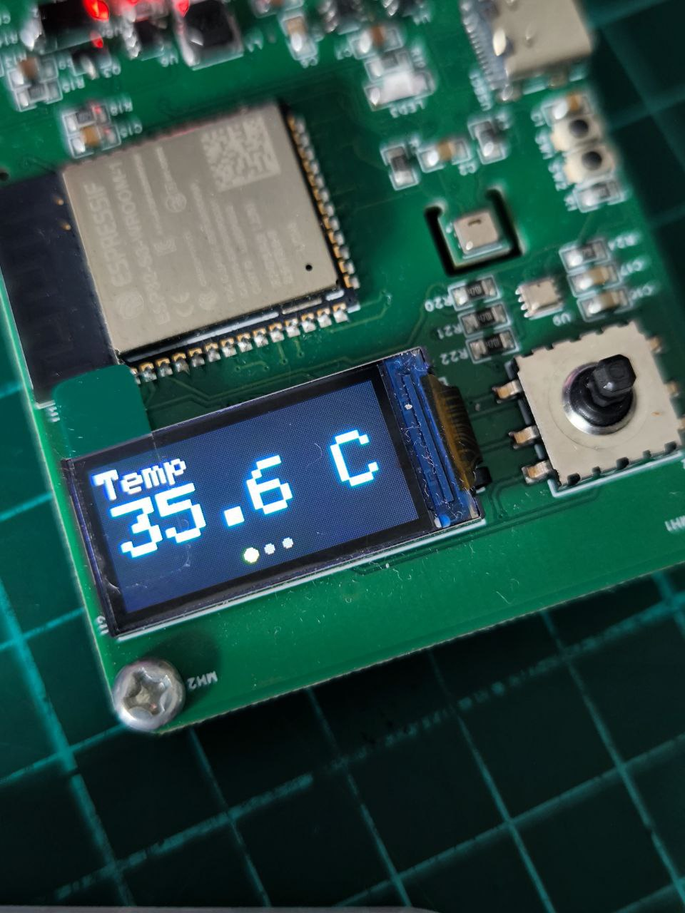

# ESP32-Based Portable Environmental Monitor
A compact, battery-powered environmental monitoring device built with the ESP32. It measures temperature, humidity, and pressure using AHT20 and BME280 sensors, displaying real-time data on a colorful TFT screen. Designed for portability and versatility, it supports both USB-C and Li-Po power, making it perfect for personal, educational, or IoT development use.

A simple test program for the 0.96" 80×160 TFT display (ST7735S driver) connected to the ESP32-S3-WROOM-1.

## 🧠 Features
- Demonstrates SPI communication with ST7735S TFT
- Uses Adafruit_GFX and Adafruit_ST7735 libraries
- Smooth color animation test

## 🔌 Pin Configuration

| Function | ESP32-S3 Pin | Description |
|-----------|--------------|--------------|
| TFT_CS    | GPIO16 | Chip Select |
| TFT_DC    | GPIO47 | Data/Command |
| TFT_RST   | GPIO21 | Reset |
| TFT_SCLK  | GPIO17 | SPI Clock |
| TFT_MOSI  | GPIO18 | SPI Data |
| TFT_MISO  | — | Not used |
| Power     | 3.3 V | VDD, LEDA |
| Ground    | GND | GND, LEDK |

## 🧰 Libraries
- [Adafruit GFX](https://github.com/adafruit/Adafruit-GFX-Library)
- [Adafruit ST7735 and ST7789](https://github.com/adafruit/Adafruit-ST7735-Library)

## 🧱 Hardware
- **ESP32-S3-WROOM-1** (8 MB Flash, No PSRAM)
- **Display:** N096-1608TBBIG11-H13 (ST7735S 80×160 TFT)

## 🖼️ Output
Animated color-changing rectangle and text confirming correct display initialization.
